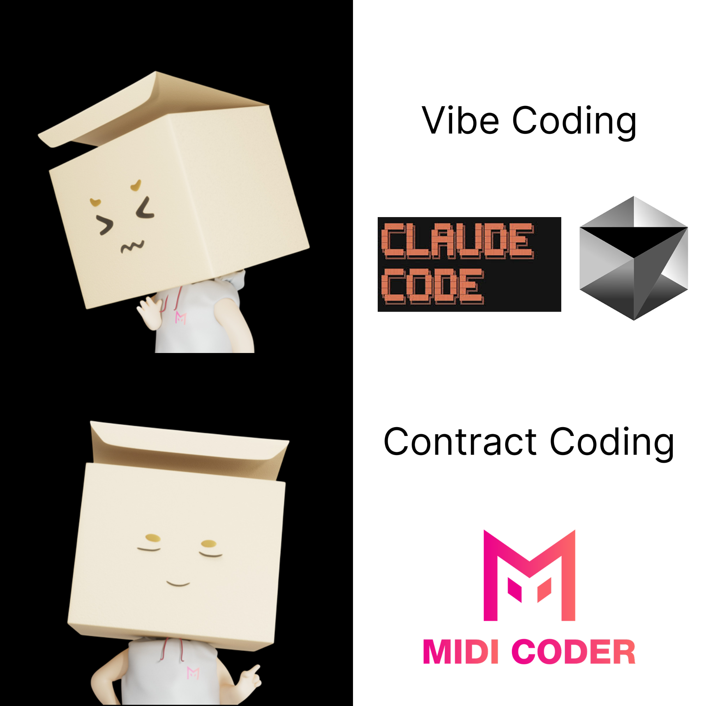

# Midicoder

**Stop vibe coding. Start contract coding.**

Midicoder là một công cụ **AI coding pipeline mã nguồn mở** giúp biến ý tưởng sản phẩm thành code **một cách có cấu trúc, deterministic và reviewable**.

Thay vì để AI "đoán" code từ prompt và rewrite cả file, Midicoder vận hành theo triết lý:

> **Code được sinh ra từ contract, không phải từ vibe.**

---

# 🇻🇳 Built by Vietnamese engineers

Midicoder được xây dựng và phát triển bởi **đội ngũ kỹ sư Việt Nam**, với mục tiêu tạo ra một cách tiếp cận mới cho AI-assisted development:

- minh bạch
- deterministic
- production-ready

Chúng tôi tin rằng AI không nên thay thế engineering discipline.

AI nên **khuếch đại engineering discipline**.

---

# Vì sao Midicoder tồn tại?

Làn sóng **vibe coding** đang rất phổ biến:

- prompt
- AI viết code
- sửa
- prompt lại

Nhưng với codebase lớn, cách này nhanh chóng trở nên:

- khó kiểm soát
- khó review
- khó maintain
- khó reproduce

Midicoder đưa ra một hướng tiếp cận khác:

## Contract Coding

Trước khi code được sinh ra, hệ thống sẽ tạo ra một **bộ contract DSL** mô tả:

- domain
- commands
- workflows
- API
- policy

Contract trở thành **source of truth** cho toàn bộ pipeline.

---

# Midicoder pipeline

Midicoder hoạt động như một **AI coding pipeline** gồm nhiều stage rõ ràng:

```
master brief
      ↓
contracts (DSL)
      ↓
IR (deterministic)
      ↓
code plans
      ↓
patch plans
      ↓
apply patches
```

Điều này mang lại:

- reproducibility
- auditability
- diff rõ ràng
- dễ review

AI không bao giờ ghi file trực tiếp.

AI chỉ:

- sinh DSL
- đề xuất patch

CE sẽ thực thi patch một cách an toàn.

---

# Những nguyên tắc cốt lõi

## Contract‑first

Contract DSL là **source of truth**.

## Deterministic pipeline

Các bước compile (contracts → IR → plans) **không phụ thuộc LLM**.

## Patch‑based generation

Midicoder không rewrite file.

Nó tạo **patch nhỏ có anchor**, giúp review và rollback dễ dàng.

## Artifact‑driven

Mọi bước đều tạo artifact:

```
.midicoder/
```

Bạn có thể audit toàn bộ pipeline.

---

# Midicoder không phải là AI chat

Midicoder không phải là:

- Copilot
- Cursor
- ChatGPT coding

Midicoder là:

> **AI software engineering pipeline**

---

# Khi nào nên dùng Midicoder

Midicoder phù hợp khi:

- bạn build backend system
- bạn cần maintain codebase lớn
- bạn muốn AI nhưng vẫn giữ engineering discipline

Không phù hợp khi:

- bạn chỉ viết script nhỏ
- prototype nhanh

---

# Triết lý

```
vibe coding → fun
contract coding → ships
```

---

# Bắt đầu

```bash
pip install -e .

midicoder init
midicoder index
midicoder version create 0.1.0
midicoder contract gen
midicoder ir build
midicoder code build
midicoder code gen
midicoder code apply
```

---

# Tầm nhìn

Chúng tôi tin rằng thế hệ tiếp theo của AI coding sẽ không chỉ là:

"chat với AI"

mà là:

> **AI‑native software engineering pipelines**

Midicoder là một bước đầu tiên.

---

# Open Source

Midicoder là **open source**.

Chúng tôi chào đón mọi đóng góp từ cộng đồng developer.

Đặc biệt là cộng đồng **engineer Việt Nam**.

---

# Một ý tưởng từ Việt Nam

Midicoder được tạo ra bởi một nhóm kỹ sư Việt Nam với mong muốn:

> Việt Nam không chỉ là nơi gia công phần mềm.

> Việt Nam có thể tạo ra **những ý tưởng engineering mới cho thế giới**.

Nếu bạn thấy ý tưởng này thú vị, hãy ⭐ repository.

